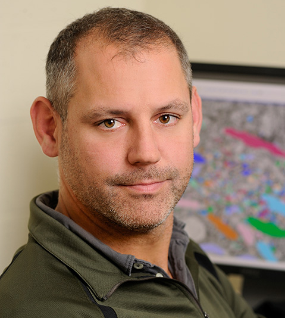
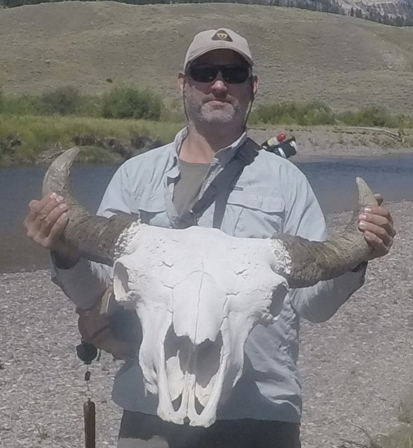

 
<!--- 

 --->

### Randal Burns

_email_: randal(at)jhu.edu  
_phone_: I don't answer  
_office_: 227 Malone Hall  
_mailing_: 160 Malone Hall, 3400 N. Charles St,  Baltimore, MD 21218  

[Randal Burns on Google Scholar](https://scholar.google.com/citations?user=rTJTJJ4AAAAJ)  
[Recent CV](./rbcv.pdf)

* * * 

<small>As of July 1, 2018, I became the Chair of the [Department of Computer Science](http://www.cs.jhu.edu). I represent a great group of faculty at an interesting time. </small>  

Here are a couple of interesting recent items:
  * NeuroData was featured in [Nature](https://www.nature.com/articles/d41586-018-07195-2) in the _ToolBox_ column highlighting scientific tools.  We have a related article in [Nature Methods](https://www.nature.com/articles/s41592-018-0181-1)
  * [University of California, Santa Cruz. Distinguished Graduate Student Alumni Award.](https://news.ucsc.edu/2018/04/distinguished-grad-alumni-advance-feature.html?utm_source=04-24-2018&utm_medium=email&utm_campaign=tuesday-newsday)
  * [Gigantum](http://www.gigantum.com/) is making data science repoducible and sharable. Our open-source product was released in May 2018 and the cloud version in November 2019.
  * [Chair's Message](https://www.cs.jhu.edu/about/message-from-the-chair-2/)
 
* * *

Randal Burns is a Professor and  Chair of [Computer Science](http://www.cs.jhu.edu) in the [Whiting School of Engineering](http://wse.jhu.edu) at [Johns Hopkins University](http://jhu.edu).  
His research has pushed the scalability limits of data science based on emergent storage technologies. This has ranged from engineering file systems for storage area networks in the 1990s, building scientific web services on scale-out cloud storage in the 2000s, and developing graph and sparse-matrix engines for machine learning in the 2010s.  His work has been inspired by high-throughput science, including numerical simulations for turbulence, neuroscience microscopy, and observational astronomy.

Burns earned his PhD in Computer Science from the University of California Santa Cruz in 2000 and a BS in Geophysics from Stanford in 1993. Prior to joining the faculty at Johns Hopkins, he was a research staff member at IBM’s Almaden Research Center, where he won an Outstanding Innovation Award. Burns is a recipient of the NSF Career Award and was a DOE Early Career Principal Investigator. He is a Kavli Fellow and served as a member of the Defense Science Study Group class of 2012-2013.”

He is a co-founder of [NeuroData](http://neurodata.io) along with [Joshua Vogelstein](http://jovo.me).  NeuroData democratizes access to world-class data sets, including electron-microscopy connectomics, CLARITY, MRI, and array tomography data.  

Randal is a core member of the [JH Turbulence Database Group](http://turbulence.pha.jhu.edu).  He and his students have built Open Numerical Laboratories in which anyone can explore, mine, and analyze world-class turbulence simulations.

At Johns Hopkins, Randal is both a member of and on the steering committee of the [Kavli Neuroscience Discovery Institute](http://hub.jhu.edu/2015/10/01/kavli-neuroscience-discovery-institute/).  He is a member of the [Institute for Data-Intensive Science and Engineering](http://idies.jhu.edu).

Prior to arriving at JHU in 2002, Randal was Research Staff Member at [IBM’s Almaden Research Center](http://www.almaden.ibm.com) in San Jose.  He earned his Ph.D. in 2000 and M.S. in 1997 from the [Department of Computer Science](http://cs.ucsc.edu) at the [University of California at Santa Cruz](http://ucsc.edu]) (_Go Slugs!_).  He earned his B.S. degree from the [Department of Geophysics](http://geophysics.stanford.edu) at [Stanford University](http://stanford.edu) (_Go Cardinal!_)

